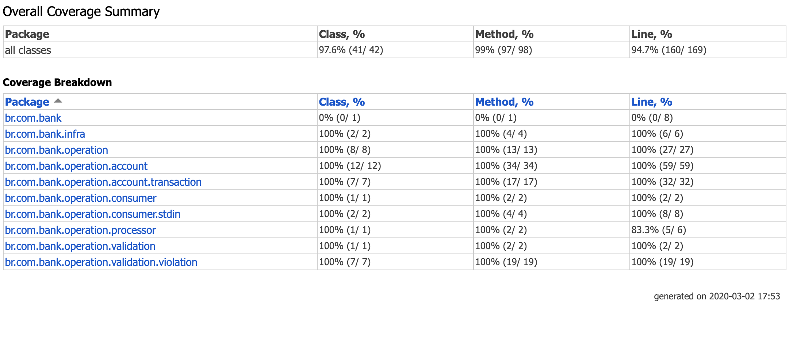

# Bank-Account

### Purpose
- Account creation just once.
- Transaction authorization for the created account.
- Error handling transforming to violations any violation of expected business rule.

### Technologies
- Kotlin
- Gradle
- Docker

### Project Organization
- We decided to use the `Package by Feature approach` to present the project by the problem that he solves and not by the way that will be provided to the user and organize the packages to have more cohesion and high modularity, and with minimal coupling between packages. If you want to read more about package by feature [click here](http://www.javapractices.com/topic/TopicAction.do?Id=205)

### Dependencies
- [Jackson](https://github.com/FasterXML/jackson-module-kotlin) to transform Json Strings to Objects
- [Mockk](https://github.com/mockk/mockk) to Mock some objects in the tests
- [AssertJ](https://github.com/joel-costigliola/assertj-core) to make more fluent the tests with exception
- [Shadowjar](https://github.com/johnrengelman/shadow) to create the fat jar that will be use in the Dockerfile

### Project Setup
- Docker
	- `docker build -t bank-account .`
- Gradle
	- `gradle clean build`
	
### Project Running
- Docker
    - `docker run --rm --name bank-account -it bank-account`
- Gradle
    - `gradle clean test run`
    
- Send event messages, like:
```sh
{"account": {"active-card": true, "available-limit": 100} }
{"transaction": {"merchant": "Burger King", "amount": 20, "time": "2019-02-13T11:00:00.000Z" }}
{"transaction": {"merchant": "Habib's", "amount": 20, "time": "2019-02-13T11:00:00.000Z" }}
```
- If you want to process the events just add an empty line like if you are consuming a unix file (EOL Unix).

### Main decisions
- Always need to be just one or none account active at the same time.
- Creation of some interfaces to make the project easy to be extensible like if the project needs to change the data source (`DataConsumer`, `Reader`, `OperationEvent`, `Operation`, `OperationViolation`).
- We implemented a `batch` application to read some transactions based in a specific account but if we need to implement a `stream` reader we can easily add this just creating another implementation for the `DataConsumer`.
- To execute the event list process you need to insert a empty line (like EOL Unix file).
- The transaction events always will be ordered by `time`.
- The return of transaction events process will be returned in the order of `time`.
- As the execution is sequential we decided for no multi-thread approach but something could be implemented with [corroutines](https://proandroiddev.com/synchronization-and-thread-safety-techniques-in-java-and-kotlin-f63506370e6d) or [workers](https://kotlinlang.org/docs/reference/native/concurrency.html#workers).

### Test Coverage

